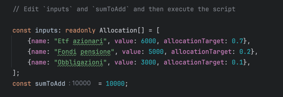
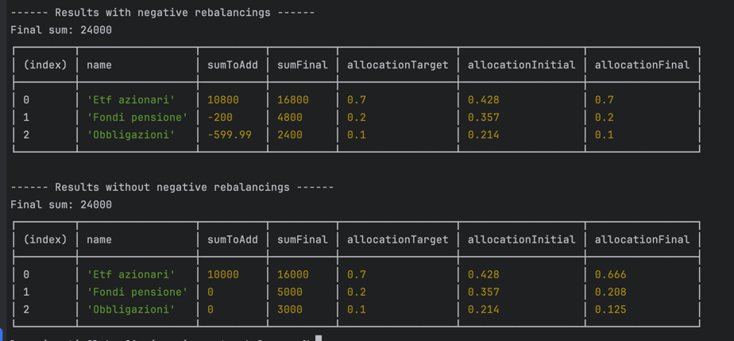

Calculate how to divide a sum entering an investement, between all assets with different allocations. The initial sums may not be already in a balanced allocation.

My objective was to add money to the investment without selling any existing asset. I wanted to find an algorithm that didn't include negative rebalancings. Durying my work I also found a way to calculate how to remove a sum and keeping the target allocation at the same time.


## Usage

The script does not accept arguments and the inputs are hardcoded in the code. So to test with different inputs you must edit the typescript code.

### Inputs

Edit the initial part of the `main()` function to change the inputs. Inputs are:

- An array were every element represent one asset, the current allocated value (`value` field) and the allocation target, are the data required. A name of the asset is added for clarity when printing the results.

- The sum we are going to add in the investment, can be positive (buying) or negative (selling)



### Outputs results

After the execution of the script, two results are displayed, one the permits negative rebalancings and another that don't permit them.  The results report the sum to add to each asset and the final asset allocation.



## How to use the script

### Dependencies installation

This script requires node and yarn. I assume you are familiar with node, or at least you have node installed on your machine. To install node visit https://nodejs.org and install the latest LTS (Long Term Support) version.

Clone this repository, and at the root of the repository run `yarn install` in a terminal.

That's it 🚀

### Script run

In the `package.json` are located two scripts to run the application, one that use `ts-node` and another that first transpile the typescript code in javascript and then execute it with `node`. Homewer the script can be run directly from the cli like a bash script.

```shell
# Directly from the terminal
> ./src/main.ts
```

```shell
# Using ts-node
> yarn start:ts-node
```

```shell
# Transpile and run
> yarn start:node-dev
```
